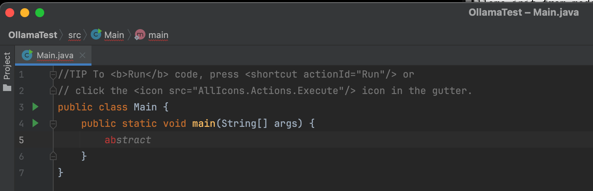
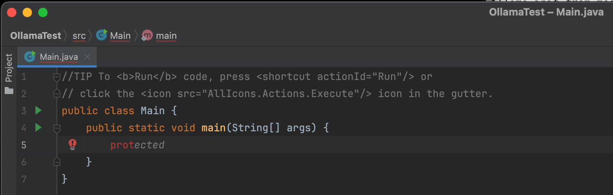
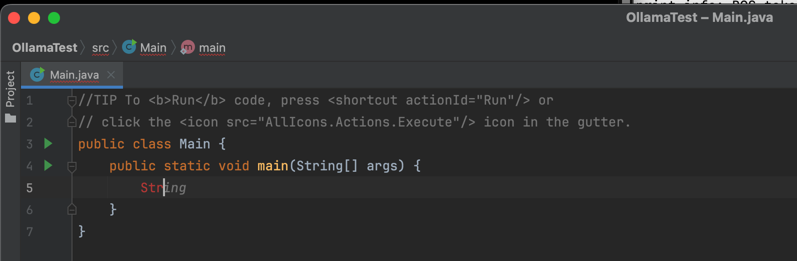
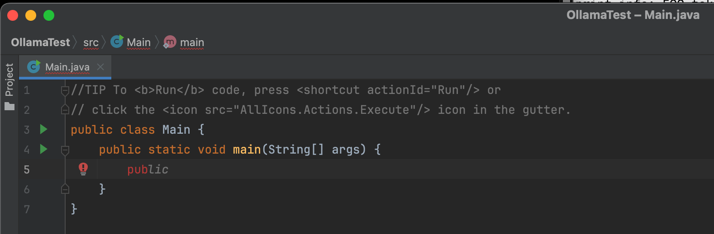

# Ollama Inline Completion Plugin for IntelliJ IDEA

## Installation and Usage
Before using the actual plugin, make sure to do the steps below:
1. Download Ollama on your laptop / PC by using [this](https://ollama.com/) link.
2. Open the app and follow the on-screen instructions to install Ollama.
3. Install codellama as autocompletion is based on this model: ```ollama pull codellama```.
4. Download the project using git clone command.
5. Run ```ollama serve``` in terminal to run the server.
6. In IntelliJ IDE run ```./gradlew build``` and after ```./gradlew runIde```. It will start a plugin in a separate IntelliJ IDEA instance.

## Examples
I will provide four examples of autocompletion for Java.

The plugin provides inline code completion suggestions as gray text while typing in a Java file, with a green tick indicating that a suggestion is ready to accept by pressing Tab. 
The following examples demonstrate the plugin in action within a main method, showing how it suggests Java keywords based on the typed prefix.








